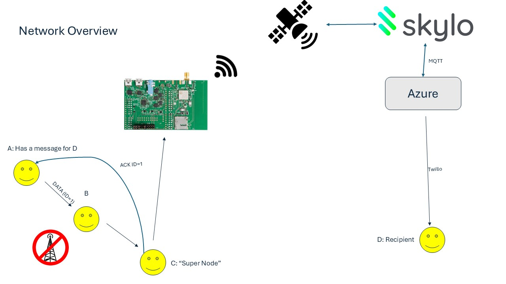

## Calhacks 11.0

This is our project for [Calhacks 11.0](https://hackberkeley.org/).

[Devpost](https://devpost.com/software/resilink)

We won:
- 1st place for [Skylo: Seamlessly Switch from Cellular to Satellite](https://live.hackberkeley.org/prizes#:~:text=Skylo%3A%20Seamlessly%20Switch,our%20technical%20recruiter.)
- [Cal Hacks: Hack for Impact](https://live.hackberkeley.org/prizes#:~:text=Skylo%3A%20Seamlessly%20Switch,our%20technical%20recruiter.)

### Overview

Resililink is a node-based mesh network leveraging LoRa technology to facilitate communication in disaster-prone regions where traditional infrastructure, such as cell towers and internet services, is unavailable. The system is designed to operate in low-power environments and cover long distances, ensuring that essential communication can still occur when it is most needed. A key feature of this network is the integration of a "super" node equipped with satellite connectivity (via Skylo), which serves as the bridge between local nodes and a centralized server. The server processes the data and sends SMS notifications through Twilio to the intended recipients. Importantly, the system provides acknowledgment back to the originating node, confirming successful delivery of the message. This solution is aimed at enabling individuals to notify loved ones or emergency responders during critical times, such as natural disasters, when conventional communication channels are down.

### Project Inspiration

The inspiration for Resililink came from personal experiences of communication outages during hurricanes. In each instance, we found ourselves cut off from vital resources like the internet, making it impossible to check on family members, friends, or receive updates on the situation. These moments of helplessness highlighted the urgent need for a resilient communication network that could function even when the usual infrastructure fails.

### System Capabilities

Resililink is designed to be resilient, easy to deploy, and scalable, with several key features:

- **Ease of Deployment**: The network is fast to set up, making it particularly useful in emergency situations.
- **Dual Connectivity**: It allows communication both across the internet and in peer-to-peer fashion over long ranges, ensuring continuous data flow even in remote areas.
- **Cost-Efficiency**: The nodes are inexpensive to produce, as each consists of a single LoRa radio and an ESP32 microcontroller, keeping hardware costs to a minimum.

### Development Approach

The development of Resililink involved creating a custom communication protocol based on Protocol Buffers (protobufs) to efficiently manage data exchange. The core hardware components include LoRa radios, which provide long-range communication, and Skylo satellite connectivity, enabling nodes to transmit data to the internet using the MQTT protocol. 

On the backend, a server hosted on Microsoft Azure handles the incoming MQTT messages, decrypts them, and forwards the relevant information to appropriate APIs, such as Twilio, for further processing and notification delivery. This seamless integration of satellite technology and cloud infrastructure ensures the reliability and scalability of the system.

### Key Challenges

Several challenges arose during the development process. One of the most significant issues was the lack of clear documentation for the AT commands on the Mutura evaluation board, which made it difficult to implement some of the core functionalities. Additionally, given the low-level nature of the project, debugging was particularly challenging, requiring in-depth tracing of system operations to identify and resolve issues. Another constraint was the limited packet size of 256 bytes, necessitating careful optimization to ensure efficient use of every byte of data transmitted.

### Achievements

Despite these challenges, we successfully developed a fully functional network, complete with a working demonstration. The system proved capable of delivering messages over long distances with low power consumption, validating the concept and laying the groundwork for future enhancements.

### Lessons Learned

Through this project, we gained a deeper understanding of computer networking, particularly in the context of low-power, long-range communication technologies like LoRa. The experience also provided valuable insights into the complexities of integrating satellite communication with terrestrial mesh networks.

### Future Plans for Resililink

Looking ahead, we plan to explore ways to scale the network, focusing on enhancing its reliability and expanding its reach to serve larger geographic areas. We are also interested in further refining the underlying protocol and exploring new applications for Resililink beyond disaster recovery scenarios, such as in rural connectivity or industrial IoT use cases.

## Packet Specification
```proto
syntax = "proto3";

message Packet {
  // Unique identifier for the packet (UUID4 format)
  string packet_uuid = 1;

  // Enum to specify the type of packet
  PacketType packet_type = 2;

  // Oneof to hold different types of messages
  oneof payload {
    NetworkMessage network_message = 3;
    AckMessage ack_message = 4;
    DiscoverMessage discover_message = 5;
    AnnounceMessage announce_message = 6;
  }
}

// Enum to represent different packet types
enum PacketType {
  NETWORK_MESSAGE = 0;
  ACK_MESSAGE = 1;
  DISCOVER_MESSAGE = 2;
  ANNOUNCE_MESSAGE = 3;
}

message NetworkMessage {
  // Unique identifier for the node sending the message
  string node_id = 1;

  // Timestamp for when the message was sent, in UNIX format
  uint32 timestamp = 2;

  // GPS coordinates (latitude and longitude) of the node (optional)
  Location sender_location = 3;

  // Actual text message being sent
  bytes message_content = 4;

  // Destination: could be either a node UID or telephone number
  string destination = 5;
}

// Message type for acknowledgment
message AckMessage {
  // Unique identifier for the original message being acknowledged
  string message_id = 1;

  // Unique identifier of the node sending the ACK
  string node_id = 2;

  // Timestamp for when the ACK was sent, in UNIX format
  uint32 timestamp = 3;
}

// Message type for discovery request
message DiscoverMessage {
  // Timestamp for when the discover message was sent, in UNIX format
  uint32 timestamp = 1;
}

// Message type for node announcement
message AnnounceMessage {
  // Unique identifier of the node announcing itself
  string node_id = 1;

  // Timestamp for when the announce message was sent, in UNIX format
  uint32 timestamp = 2;

  // Optional location information of the announcing node
  Location node_location = 3;
}

// Structure to capture location details
message Location {
  double latitude = 1;
  double longitude = 2;
}
```

## Architecture

